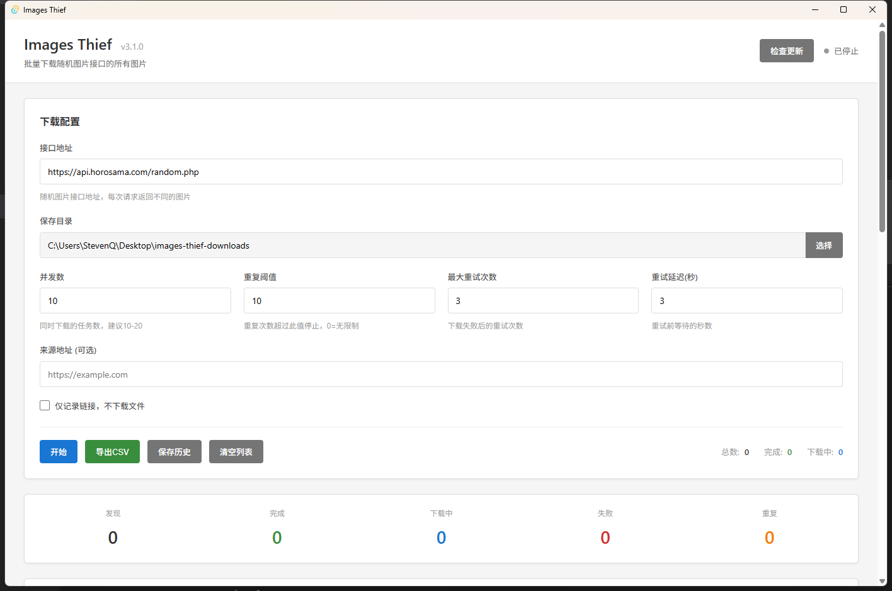

# Images-Thief

批量下载随机图片接口的所有图片

## 目的

网络上出现一些随机图片接口，请求后随机跳转至图片地址。

本工具的目的为了批量下载这些随机图片接口的所有图片。

## 功能特性

- **批量下载**：自动批量下载随机图片接口的所有图片
- **并发下载**：支持多线程并发下载，提高下载效率
- **智能去重**：自动检测并标记重复图片，避免重复下载
- **下载统计**：实时显示下载进度、速度、完成数量等统计信息
- **配置灵活**：可自定义并发数、重试次数、重试延迟等参数
- **结果导出**：支持将下载结果导出为 CSV 文件
- **历史记录**：保存下载历史，支持断点续传
- **文件管理**：右键菜单支持打开文件、打开文件夹、复制链接等操作
- **批量操作**：支持批量重试、批量删除、批量导出等功能
- **搜索过滤**：支持按文件名和状态搜索过滤下载列表

## 使用方法

### 环境要求

- Windows 操作系统

### 配置说明

1. **接口地址**：随机图片 API 接口地址
2. **保存目录**：图片保存的本地目录
3. **并发数**：同时下载的任务数（建议 10-20）
4. **重复阈值**：重复次数超过此值时停止下载（0=无限制）
5. **最大重试次数**：下载失败后的重试次数
6. **重试延迟**：重试前等待的秒数
7. **来源地址**（可选）：设置请求 Referer 头部

### 操作说明

- **开始/停止**：控制批量下载任务的启动和停止
- **导出 CSV**：将下载结果导出为 CSV 文件
- **保存历史**：保存当前下载历史记录
- **清空列表**：清空下载列表

## 界面说明

- **下载配置面板**：设置下载参数
- **统计面板**：显示实时下载统计信息
- **搜索过滤**：按条件搜索和过滤下载项
- **批量操作**：对选中的下载项进行批量操作
- **下载列表**：显示所有下载项的进度和状态

## 软件截图

---

## 反馈与支持

### 问题反馈

请提交 issue 反馈问题和建议。
